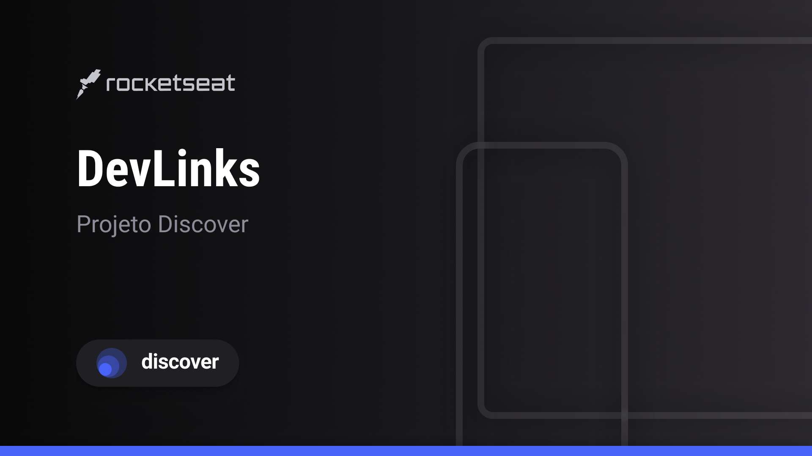

<h1 align="center">Projeto de Desenvolvimento Web</h1>

Curso Discover - Rocketseat/Mayk Brito

  

## Tecnologias
Esse projeto foi desenvolvido utilizando as seguintes tecnologias:
- HTML5
- CSS3
- JavaScript
- Git & GitHub
- Figma

## Projeto
- O projeto é uma simples página Front-End, para o aprendizado e exercício da base de desenvolvimento web.
- Este projeto é um agregador de links para usar como um cartão de visitas online. O usuário pode adicionar links e descrições para cada um deles, e também pode visualizar. Ele foi desenvolvido com o intuito de ser uma ferramenta útil para quem precisa compartilhar links de forma rápida e eficiente. 
- Ele foi criado com base em um design feito no Figma e utilizando as tecnologias HTML5, CSS3 e JavaScript para a construção do site. O projeto também utiliza o Git e GitHub para versionamento e hospedagem do código. 
- A base para o projeto foi o curso Discover da Rocketseat, ministrado pelo Mayk Brito.

## Links
Projeto
- https://jlprodutor.github.io/Discover-Project/

Curso Discover - Rocketseat
- https://app.rocketseat.com.br/journey/discover/contents

Feito por João Lucas Lima Alexandre - 2024
